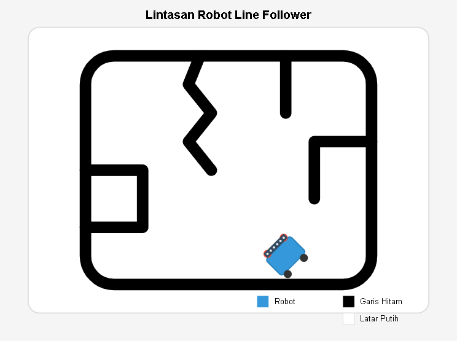

<p align="center">
  
</p>

<h1 align="center">🤖 Robot Line Follower</h1>

<p align="center">
  <strong>6 TCRT5000 Sensors + PID Control — Arduino Uno R3</strong>
</p>

<p align="center">
  
  
  
  
</p>

---

## 📋 Overview

An autonomous line-following robot built on Arduino Uno R3. Uses **6 IR sensors** (TCRT5000) for precise line detection and a **PID controller** for smooth, high-speed path tracking. Suitable for robotics competitions and educational projects.

### Features

| Feature | Description |
|---|---|
| **6‑Sensor Array** | Wide detection range, handles sharp turns & zigzags |
| **PID Tracking** | Configurable Kp/Ki/Kd for track-specific tuning |
| **Auto‑Calibration** | ~5‑second calibration on every startup |
| **Line‑Lost Recovery** | Progressive search: head toward last known side → reverse → spin |
| **Intersection Detection** | All sensors black → go straight automatically |
| **Serial Debug** | Real‑time position, error, and sensor status output |

---

## 🧰 Hardware

| Component | Quantity | Notes |
|---|---|---|
| Arduino Uno R3 | 1 | Or any ATmega328P board |
| TCRT5000 IR Sensor | 6 | Reflective optical sensor |
| L298N Motor Driver | 1 | Dual H‑bridge |
| DC Motor (w/ wheel) | 2 | 3‑6V, ~100 RPM |
| Caster Ball | 1 | Free‑rotating front support |
| Li‑Po / Li‑Ion Battery | 1 | 7.4V recommended |
| Acrylic / ABS Chassis | 1 | Custom or generic line‑follower chassis |

### Wiring

```
   TCRT5000 Array         Arduino Uno            L298N
  ┌────────────────┐     ┌───────────┐      ┌────────────┐
  │ Sensor 0 (left)│────▶│ A0        │      │            │
  │ Sensor 1       │────▶│ A1        │      │  ENA ▶ 5   │
  │ Sensor 2       │────▶│ A2        │      │  IN1 ▶ 8   │
  │ Sensor 3       │────▶│ A3        │      │  IN2 ▶ 9   │
  │ Sensor 4       │────▶│ A4        │      │  IN3 ▶ 10  │
  │ Sensor 5 (right)│───▶│ A5        │      │  IN4 ▶ 11  │
  └────────────────┘     │           │      │  ENB ▶ 6   │
                         │           │      └────────────┘
                         └───────────┘
```

*(See [spesifikasi.txt](ard/code/spesifikasi.txt) for full detail.)*

---

## 🚀 Getting Started

### 1. Install Arduino IDE

Download from [arduino.cc](https://www.arduino.cc/en/software).

### 2. Open the sketch

```
File → Open → ard/code/line_follower.ino
```

### 3. Upload

1. Connect your Arduino via USB.
2. Select board: `Tools → Board → Arduino Uno`.
3. Select port: `Tools → Port → /dev/ttyUSB0` (Linux) or `COM3` (Windows).
4. Click **→** (Upload).

### 4. Run

Place the robot on a black line on a white surface and power it on. The robot calibrates for 5 seconds, then starts tracking automatically.

> ⚠️ **Calibration note:** During calibration, move the robot so each sensor sees both the black line and the white surface. This ensures proper threshold detection.

---

## ⚙️ Tuning

### PID Constants

Default values (good starting point for 18‑25 mm black line on white):

| Parameter | Default | Range | Effect |
|---|---|---|---|
| `KP` | 25 | 10–100 | Reactivity to line deviation |
| `KI` | 0 | 0–50 | Steady‑state error correction |
| `KD` | 15 | 0–50 | Dampens oscillation |

**Tuning tip:** If the robot oscillates → lower `KP` or raise `KD`. If it's sluggish → raise `KP`. Most tracks only need `KP` + `KD`.

### Speed

| Constant | Default | Notes |
|---|---|---|
| `SPEED_BASE` | 150 | Normal tracking speed |
| `SPEED_MAX` | 200 | Upper speed limit |
| `SPEED_TURN` | 120 | Line‑search speed |
| `SPEED_SLOW` | 80 | Precision turns |

---

## 📁 Repository Structure

```
robot_line_follower/
├── ard/
│   ├── Gambar_Lintasan.png        # Track illustration
│   └── code/
│       ├── line_follower.ino      # Main Arduino sketch
│       └── spesifikasi.txt        # Detailed hardware spec
├── LICENSE                        # MIT License
├── .gitignore
└── README.md
```

---

## 🛠️ Common Issues

| Symptom | Likely Fix |
|---|---|
| Robot doesn't follow line | Re‑calibrate: ensure sensors see black & white during startup |
| Oscillates wildly | Lower `KP` or raise `KD` |
| Loses line on sharp turns | Raise `SPEED_SLOW`, check sensor alignment |
| Motors don't move | Verify L298N power (5‑12V input), check ENA/ENB jumpers |
| Erratic sensor readings | Reduce ambient IR light; add heat‑shrink to sensor housings |

---

## 📄 License

MIT — see [LICENSE](LICENSE) for details.
